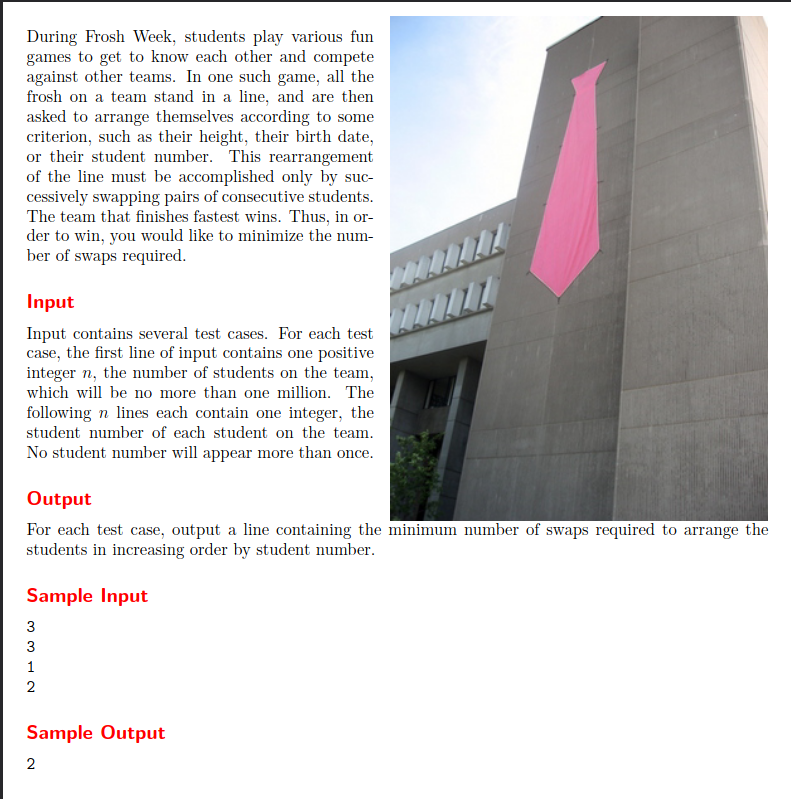
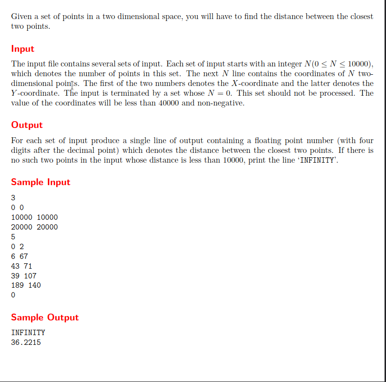
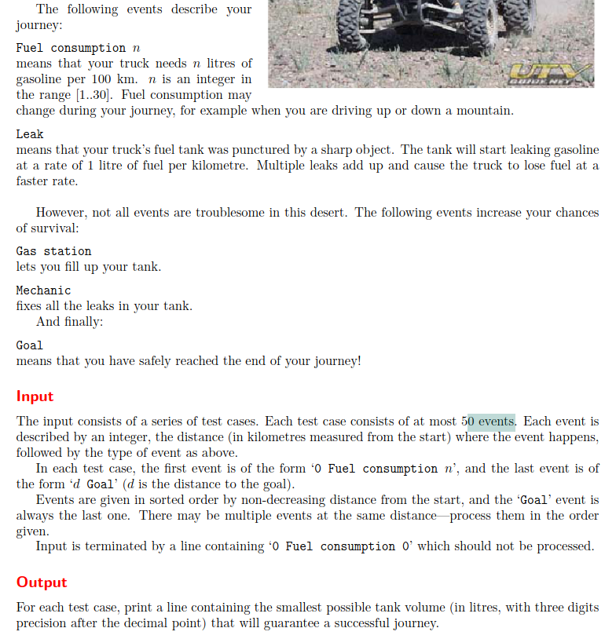
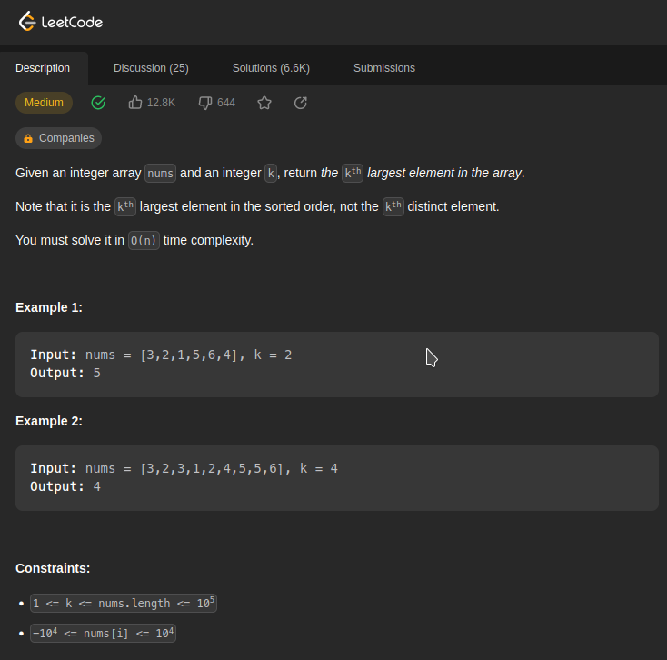
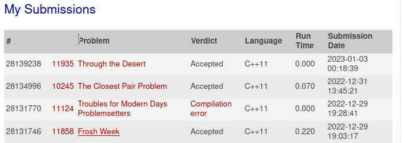
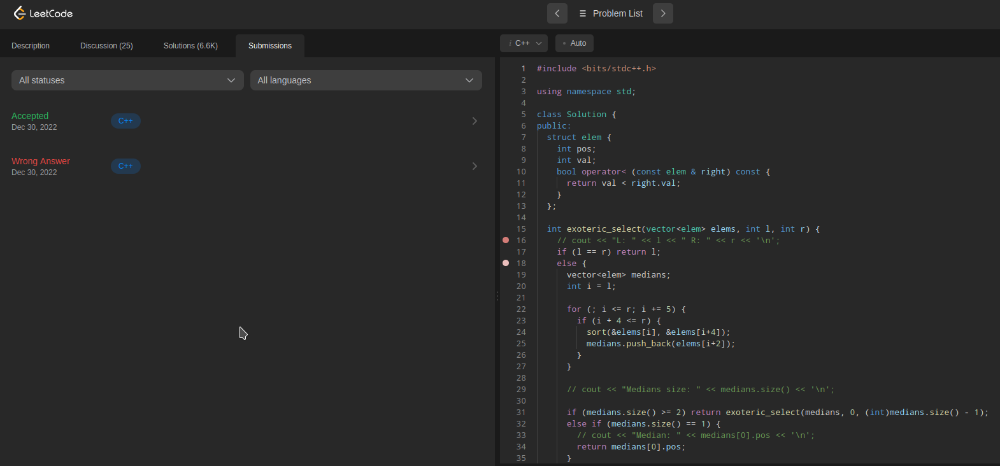

Temas:
 - Dividir e Conquistar Resolusão de problemas

# Problemas de Dividir e conquistar

**Número da Lista**: 22 
**Conteúdo da Disciplina**: Dividir e conquistar, Mediana das medianas, Par de pontos mais próximos, contagem de inversões. 

## Alunos
|Matrícula | Aluno |
| -- | -- |
| 16/0000572  |  Adrian Soares Lopes|
| 19/0047968  |  Paulo Vítor Silva Abi Acl |

## Sobre 
Resolvemos optar por realizar 4 questões sobre a matéria de dividir e conquistar, você pode encontrar o código fonte das questão em cada uma das pastas.

## Screenshots

### 11858 - Frosh week (inversion count)

### 10245 - Closest points

### 11935 - Through the Desert (Bin search to minimize)

### 215. Kth Largest Element in an Array

### Submissões

## Instalação
**Linguagem**: c++  

## Uso 
É necessário ter o c++ 11 instalado e o make. Para rodar basta digitar o comando make dentro da pasta referente ao problema. 

Caso queira usar os casos de teste depois de rodar make, rode o código compilado (identificado pelo código da questão) e utilize os casos de teste (identificados como <cód da questão>.in)
    
ex.:
./11935 <11935>.in

## Outros 
Apresentação se encontra na pasta assets, arquivo apresentacao.mp4